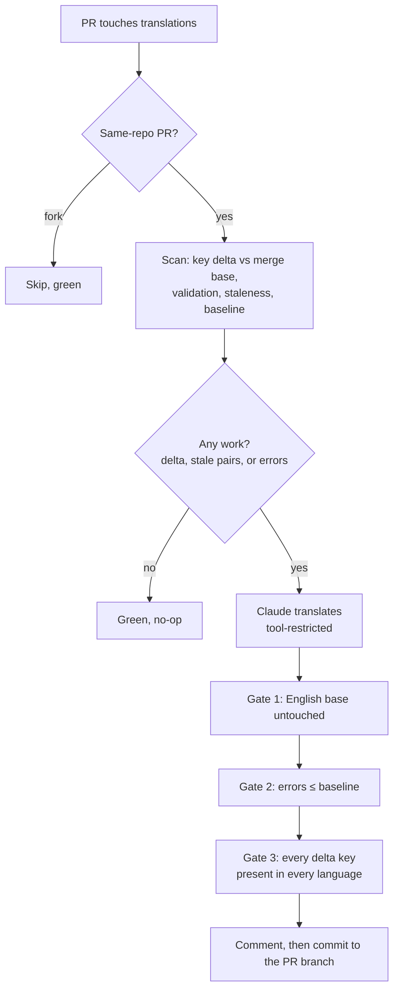

# Translations Sync — how it works

`reusable-translations.yaml` keeps a bundle's `studio.{locale}.yaml` files in sync with its English
base. When a PR changes translation keys, CI translates the missing ones, commits them back to the
PR branch, and posts a single comment explaining what it did.

The design principle: **deterministic scripts decide everything; the model only writes translations.**
Scripts choose what needs work, and scripts decide whether the result is acceptable. Nothing the
model produces is committed unless it passes checks the model cannot influence.

## The flow



Each gate can only fail the job — never soften it. A failure stops the run before anything is
committed or commented.

## The two ideas worth understanding

### 1. Everything is measured against the merge base, not against zero

A repo adopting this workflow usually has pre-existing drift — `studio-ui-bundle` had 151 validation
errors before any of this existed. If the gate demanded zero errors, every PR in such a repo would
be red forever and adoption would be impossible.

So the rule is **"no worse than the merge base"**: the workflow validates the merge base's own
translation files, and the job passes when the final error count is less than or equal to that
baseline. Pre-existing errors sit on both sides of the comparison and cancel out.

That rule is also self-tightening. Adding one English key makes it missing in six languages, so the
count rises by six; it only returns to baseline if the model actually translates it everywhere.
Removals behave the same way, via "extra key not in English".

### 2. Counts alone can't prove the PR's own keys landed

The model also repairs pre-existing errors when it can (see *Scope* below), which creates a trap: a
legacy error it fixes can offset a delta key it missed, leaving the total unchanged and the job
green while your key is absent.

So a second, independent check runs after the count comparison. `delta_check.py` asserts, per key and
per language, that every added key is **present** and every removed key is **gone**. It enumerates
the languages configured in the skill's `languages.yaml` rather than the files on disk, because a
language file that doesn't exist at all costs the validator only a single `MISSING FILE` error —
which the count comparison cannot see.

## Scope: what it will and won't do

| | |
|---|---|
| **Mandatory** | Keys this PR adds or removes, applied to every configured language. The job fails if they're missing. |
| **Best effort** | Pre-existing validation errors elsewhere in the files. The model fixes what it can; partial progress is green, and successive PRs converge the repo toward zero. |
| **Left alone** | Values identical to English ("untranslated"). Those are *warnings*, not errors — technical terms legitimately stay in English, so they are never mass-rewritten. |
| **Human-judged** | Reworded English values. Nothing structural changes, so no gate can verify the translation was updated. Any translation the model chose to keep is listed in the PR comment for review. |

Because backlog cleanup is in scope, a PR's commit may touch keys unrelated to your change. The PR
comment breaks down what was your delta and what was cleanup.

## Why the model can't go off the rails

- It runs with an explicit tool allowlist: it may edit only `studio.{locale}.yaml` files and an
  ambiguity report, and may run exactly one command — the validator, matched byte for byte.
- `studio.en.yaml`, the validator itself, the scan inputs, and `.git` are all explicitly denied, so
  it can neither change the English source nor rewrite the checks that judge its output.
- It has no git or network access. The workflow does the committing.
- The private `pimcore/claude-code` checkout is deleted before the model starts; it only sees a copy
  of the skill.
- Fork PRs are skipped entirely, so untrusted code never runs alongside the secrets.

## Loop termination

The bot's own commit re-triggers CI. That run detects its own commit subject and exits green without
invoking the model, so there is **at most one bot commit per human push** — regardless of whether the
model's output is stable.

## Using it

```yaml
jobs:
  translations:
    uses: pimcore/workflows-collection-public/.github/workflows/reusable-translations.yaml@main
    with:
      translations_dir: translations   # or src/Resources/translations
    secrets:
      TRANSLATIONS_GITHUB_TOKEN: ${{ secrets.TRANSLATIONS_GITHUB_TOKEN }}
      ANTHROPIC_TRANSLATIONS_API_KEY: ${{ secrets.ANTHROPIC_TRANSLATIONS_API_KEY }}
```

Full caller with triggers and concurrency: [`examples/translations.yaml`](../examples/translations.yaml).

**Inputs:** `translations_dir` (required), `claude_code_ref` (default `main`), `model`
(default `claude-sonnet-5`).

**Secrets:** `TRANSLATIONS_GITHUB_TOKEN` needs contents:write on the consumer repo, read on
`pimcore/claude-code`, and pull-requests:write. `ANTHROPIC_TRANSLATIONS_API_KEY` is a dedicated key
for this workflow.

**Don't make it a required status check** — the `paths` filter means it never starts on PRs that
touch no translations, and a required check that never reports blocks them forever.

The translation rules themselves — languages, glossary, style guidelines — live in the
`pimcore-studio-ui-i18n-translation-workflow` skill in `pimcore/claude-code`, not here.
